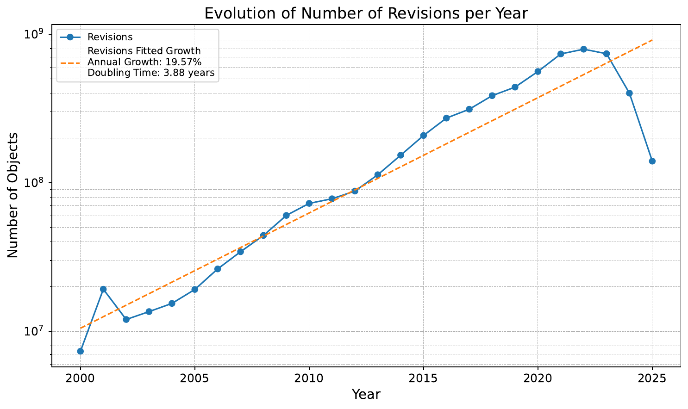
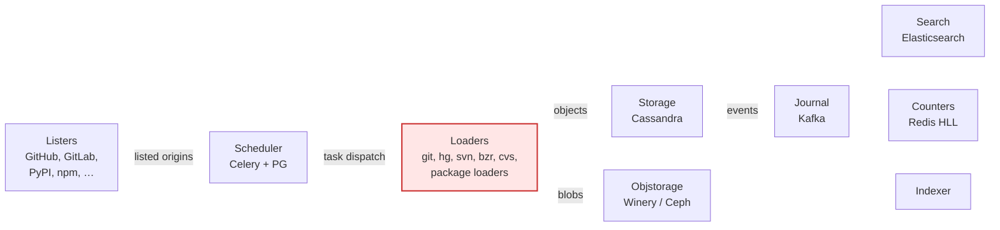
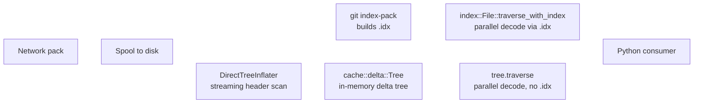

<!--
  HedgeDoc: open the note → View → Slide mode (Reveal.js).
  Slides: `---` on its own line = horizontal; `----` = vertical stack.
  Speaker notes: paragraph starting with `Note:` (speaker view, press S).
  Local preview from disk: `make -f notes/presentations/Makefile preview-watch`.
-->

<style>
.reveal .slides section { font-size: 0.68em; line-height: 1.2; }
.reveal .slides section h1 { font-size: 1.55em; }
.reveal .slides section h2 { font-size: 1.28em; }
.reveal .slides section h3 { font-size: 1.10em; }
.reveal .slides section table { font-size: 0.80em; }
.reveal .slides section pre { font-size: 0.70em; }
</style>

# Supercharging our git loader — Tech team leadership overview

Investigating SWH's ingestion lag, phase 1: our next git loader.

**Audience:** SWH tech leadership team · **~30–45 min**

Note: The deck is paced as problem → diagnosis → measurement → shock → solution. We open with the lag (the production fact), enumerate the pipeline as a suspect list, narrow to the git loader because it is the most invoked component we directly own, then measure it. Only after the room agrees the loader is a real bottleneck do we name gitoxide. Backing report: `report/ANALYSIS-git-loader-modernization.md`.

---

## The lag

<div style="display: flex; align-items: center; gap: 1.5em;">
<div style="flex: 0 0 60%;">

</div>
<div style="flex: 0 0 35%; font-size: 0.95em;">

- **Two decades on a healthy curve** — 19.57 % yearly growth, 2000-2023 (doubling 3.88 y).
- **2024-2025: a 6× drop.** 2025 ingestion (~1.4 × 10⁸) is *below 2014 levels*.
- **A cliff, not a wobble.** The pipeline stopped keeping up with the source-code universe.

This is what the deck is about.

</div>
</div>

Note: Open on the chart. Let the audience absorb the cliff. Resist the urge to name a culprit — the chart establishes the *fact*, not the diagnosis. The next slide enumerates suspects.

---

## The ingestion pipeline — a reminder



- **Any of these components** could be the rate-limiter on the lag, we must investigate them all:
  - lister rates, scheduler queue depth, loader visit time, storage write latency, journal lag, ...
- **This deck focuses on the git loader** for the reasons on the next slide.

Note: The point of this slide is to make the investigation framing visible: we are not assuming the loader is the bottleneck — we are treating it as one suspect among many. After this deck the team will have evidence on the loader; remaining suspects (storage write path, scheduler dispatch, lister coverage) await their own deep dives.

---

## Why we look at the git loader first

Three reasons make it the right first suspect:

1. **Coverage.** the most-invoked component on the ingestion path.
2. **Code path age.** one of the longest-lived production code paths in SWH. Our assumptions may no longer hold today.
3. **Control.** Storage and scheduler bottlenecks usually require coordinating with infrastructure layers (Cassandra ops, Celery scaling, etc.). The loader's hot path is in our Python and our control. If the gap is here, we can act on it easily now.

So: investigate it first, *measure* whether it carries weight, and only then conclude. That is what the next slides do.

Note: This slide is rhetorical scaffolding. The audience needs to see we picked the loader on disciplined grounds, not because we already had a solution. If we measure it and the gap is small, this deck would have ended at slide 7 and we'd be onto the next suspect. We do not yet know.

---

## Firs observation: dulwich does git's work twice

For every fresh pack the production dulwich loader receives:

1. **`git index-pack` walks the pack first** — decompress, resolve deltas, hash. Native (C), multi-threaded. Builds the `.idx`.
2. **Dulwich then walks the pack again** — same decompress + delta + hash. Pure Python, single-thread, four times in a row.

Same low-level work. Performed twice. The second walk is the slow one.

Confirmed in `swh-loader-git/swh/loader/git/from_disk.py:104–118` — code on next slide.

**Why this matters for the bench.** With storage dropped, dulwich's measured cost is ~ that re-walk. Apples-to-apples to `git index-pack`.

Note: Set up the question. Code on next slide. Numbers two slides on. The discard-mode methodology was designed precisely to make this re-walk vs index-pack comparison fair — strip out everything that isn't loader work.

----

### Confirmed in the code

```python
# swh-loader-git/swh/loader/git/from_disk.py — lines 104–118
class GitLoaderFromDisk(BaseGitLoader):
    def prepare(self):
        with raise_not_found_repository():
            self.repo = dulwich.repo.Repo(self.directory)
            # ↑ Repo() opens every objects/pack/*.idx via dulwich.PackIndex
            #   — raises FileNotFoundError if a .pack is missing its .idx.
            #   For fresh packs the .idx must already have been built
            #   by `git index-pack` (last step of `git fetch`/`git clone`).

    def iter_objects(self):
        object_store = self.repo.object_store
        for pack in object_store.packs:
            objs = list(pack.index.iterentries())   # ← .idx-driven
            ...
```

Each `get_contents` / `get_directories` / `get_revisions` / `get_releases` then does `self.repo[oid]` → dulwich decompresses on demand → redoing the zlib + delta-apply work `git index-pack` already did.

Note: The `.idx` requirement is a hard API contract (`PackIndex(path)` in dulwich). The on-demand decompression is unavoidable. So the prerequisite walk and the loader walk overlap heavily on the low-level layer.

---

## First analysis: dulwich vs `git index-pack`

We check side-by-side with dulwich's re-walk on the same testbed pack:

| | linux | chromium |
|---|---:|---:|
| `git index-pack` CPU | 22 min (3 cores) | 1 h 54 min (4-5 cores) |
| Dulwich loader CPU | **4 h 17 min** (1 thread) | **19 h 00 min** (1 thread) |
| **CPU ratio** | **11.5x** | **10.0x** |
| **Wall ratio** | **35x** | **45x** |

Same low-level work. Once natively. Then again, in dulwich, but at **10x the cost**. Per pack.

Note: The first shock lands here, right after the observation. The bulk of dulwich's CPU goes to interpreter overhead doing what git already did natively. The audience should sit with this before we discuss why it can't be fixed.

---

## Can we fix this by making small changes in dulwich? 

TL;DR: no, the gap is structural, cannot be adressed by tuning parameters or minor changes:

- **Pure-Python pack inflation.** `PackInflater` walks zlib + deltas + hashes in bytecode. No native acceleration on the upstream roadmap.
- **Single-threaded, GIL-bound.** Pack inflater holds the GIL throughout. N cores available means N-1 cores idle.
- **Per-object Python overhead at scale.** `ShaFile` + attr dict + `swh.model` instance + per-object dispatch, 27.9 M times for chromium.
- **Four sequential full-pack passes.** API forces type-filtered iteration → 4x decompression. (L3.)
- **Hard `.idx` dependency.**  Indeed `Repo()` crashes if absent, so for new packs we really do the work twice (L5.)

**None is tunable.** Optimising dulwich means rewriting dulwich. Full L1-L7 in `report/ANALYSIS-git-loader-modernization.md` §4.

Note: This is the "no path to fix dulwich within dulwich" slide. Sets up the next slide where we scout for alternatives. The argument is now: 10x gap to git itself (previous slide) + structural reasons it can't shrink (this slide) = staying on dulwich is not viable.

---

## Looking for alternatives

Here are the explored options:

- **Stay on dulwich, optimise.** Pack inflater is pure Python — no inner loop to optimise without re-implementation. **Rejected.**
- **Rewrite the hot path in Rust ourselves.** Months of work, long tail of pack-format edge cases, no community to share the maintenance. **Rejected.**
- **libgit2 via cffi / pygit2.** Mature C library. FFI chain through C is memory-unsafe in the failure modes that matter; async pipelining awkward. **Rejected.**
- **gitoxide.** Pure-Rust reimplementation of git. Modular crates, active upstream, comprehensive pack-format support. **Picked.**

Bound to Python via **PyO3** (no C FFI, Rust panics cannot corrupt the Python process). Built with **maturin**, ships as a wheel.

Note: This is the design-rationale slide. The audience needs to see this was a survey, not a fashion pick. The PyO3 binding is a real safety property.

---

## Why gitoxide

- **Strong typing across the pack-format surface.** Each git object type is a Rust struct ([`gix-object`](https://crates.io/crates/gix-object), [`gix-pack`](https://crates.io/crates/gix-pack)). A class of bugs (wrong-type tree entries, malformed refs) is caught at the type level.
- **Mature.** Three years ago we would not have committed. Today: production-grade pack reader, comprehensive test suite, [used by Cargo](https://github.com/Byron/gitoxide#projects-using-gitoxide) and other Rust-ecosystem projects ([Helix editor](https://helix-editor.com/), [Onefetch](https://onefetch.dev/), …).
- **Active community.** Single-maintainer-bus-factor risk mitigated; visible [upstream momentum](https://github.com/Byron/gitoxide/graphs/contributors). Project is led by [Sebastian Thiel (`@Byron`)](https://github.com/Byron) — long-time Rust contributor, also wrote [`git-lfs-rs`](https://github.com/Byron/git-lfs-rs); active commit cadence on the [`gitoxide`](https://github.com/Byron/gitoxide) main repo.
- **Modular crates.** We pull in [`gix-pack`](https://crates.io/crates/gix-pack), [`gix-features`](https://crates.io/crates/gix-features), and friends as needed. Footprint stays small.
- **Native parallelism.** Rust threads, no GIL. Each loader can use its full container cpuset.
- **PyO3 binding** is well-trodden ground (numpy, pydantic-core, ruff, polars). [pyo3.rs](https://pyo3.rs/) — bindings build with [maturin](https://www.maturin.rs/), ship as wheels, no C FFI chain.

Note: The "why we trust it" slide. Cover the maturity point and the bus-factor risk explicitly — those are the natural worries. The links are there for the audience to verify the claims afterwards.

---

## Before starting, an architectural question: what about git index?

We have two options with gitoxide, use an external index or not:

- **Indexed.** Shell out to `git index-pack`, then decode in parallel via the resulting `.idx`. Matches gitoxide's `index::File::traverse_with_index()`.
- **Direct.** `DirectTreeInflater` builds the delta tree from a header-only scan — no `.idx`, no `git` subprocess. Traverses in parallel.

Both produce identical SWHIDs. The trade-off is setup cost and memory locality.

We keep both. One config switches a worker between modes.

[bench-results.md](../bench-results.md) · [report §5](../../report/ANALYSIS-git-loader-modernization.md)

Note: Direct mode removes the `git` subprocess dependency entirely — that's a real ops simplification.

----

### Flow diagram



Note: Walk through both branches. Same Python consumer, same model objects, same SWHIDs.

----

### Indexed vs direct — when each wins

| Dimension | Indexed | Direct |
|---|---|---|
| Setup cost | `git index-pack` subprocess | Header-only scan (parallelisable) |
| Disk footprint | `.pack` + `.idx` | `.pack` only |
| Subprocess dependency | `git` binary required | None |
| Best for small/medium | Setup amortises poorly | **30–60% faster** |
| Best for chromium-class | **14% faster** at xl scale | Page cache can't keep it hot |

**v1 default:** direct mode for small + large queues; indexed for xl as opt-in.

Note: One config flag switches modes per worker queue. No commitment to a single mode.

---

## Setting up the measurement harness (thanks David and Thomas for DiscardStorage)

Same input pack. Same xl container cell (cpuset 0-15, 64 GB). Same `BaseGitLoader.load()` machinery. Same `DiscardStorage`. **Engine is the only variable.**

- **Discard storage** isolates loader cost from storage cost (objstorage / journal / Cassandra latency).
- **CPU time** as the headline (sums across threads via `RUSAGE_SELF`) — invariant to host contention and threading.
- **xl tier** (16 vCPU / 64 GB) matches the largest production worker dimension.

Note: Three rules of the comparison. The audience already heard Shock #1 (dulwich vs git index-pack) — now we set up Shock #2 (dulwich vs the chosen alternative, on the same machinery).

---

## dulwich vs gitoxide: the data is in

Reminder: same input, same xl cell, only the engine differs:

| Repo | dulwich `cpu_s` | gix `cpu_s` | **CPU ratio** | **wall ratio** |
|---|---:|---:|---:|---:|
| flask        | 7.9     | 1.9     | 4.13x | 4.1x |
| django       | 309.5   | 61.7    | 5.02x | 14.9x |
| kubernetes   | 1,371   | 316     | 4.34x | 20.6x |
| libreoffice  | 6,058   | 1,109   | 5.46x | 15.3x |
| linux        | 15,410  | 3,102   | **4.97x** | 11.8x |
| **chromium** | **68,339** | **12,171** | **5.61x** | **24.9x** |

- **Per-thread CPU gap: 4-6x** (engine cost only)
- **Wall gap: 4-25x** (engine cost x parallelism)

Chromium: **19 h → 46 min**.

Note: CPU column is engine-only (invariant to threading). Wall column is what production actually sees.

---

## Loader memory under discard

Both engines stay well within the 64 GB xl cell. Memory is not the differentiating axis.

| Repo | dulwich `cgroup peak_GB` | gix `cgroup peak_GB` |
|---|---:|---:|
| flask        | 0.10  | 0.10  |
| kubernetes   | 0.76  | 3.07  |
| libreoffice  | 1.95  | 2.05  |
| linux        | 3.85  | 5.21  |
| **chromium** | **11.54** | **17.40** |

Notable: **dulwich uses less loader-resident memory than gix** : when gix goes parallel, we have one arena per-thread.

Memory cost of parallelism is real but inside the cell, and tunable if needed.

Note: Pre-empts "but does gix use less memory?". Answer: no, it uses more, because of parallel arenas. Both fit safely.

---

## Parallelism becomes a per-git-loader tunable!

Dulwich = always 1 thread (GIL). Gix = parallel inside the cpuset.

**CPU cost and wall-clock are now independently tunable.**

The "disappearing forge" use case — SourceForge, Google Code, Bitbucket-hg-style short-notice deprecations — needs the long tail ingested in *days*, not weeks:

|  | wall per pod | speedup recipe |
|---|---|---|
| Dulwich | linear in pod count | spin up more pods (1 thread each) |
| Gix     | `pod_count x parallelism_per_pod` | spin up more pods AND use bigger cpusets per pod |

Chromium: 19 h/pod (dulwich) → 46 min/pod (gix in xl). **A single pod's wall reduces 25x.** That compounds with pod count.

Note: This is the "we got more than just speed" slide. The CPU↔wall trade-off is a real operational lever — surge mode for emergencies. Today we cannot do this with dulwich at all.

---

## Architectural knobs that compound

Independent of the loader engine, three improvements at the architecture boundaries — each with a different origin story:

| | Where | Origin | What |
|---|---|---|---|
| **(a) Phase A0** | gix-py channel | **Surprise** — bench data exposed it. The channel was sized defensively years ago; turned out to be the binding constraint. | Rust→Python channel buffer 4K → 64K. Unblocks the parallel decoder. |
| **(b) REC-L4** | Cassandra (storage) | **Long-known sequential bottleneck.** Plan + feature branch in place; PR upcoming to swh-storage. | Concurrent `content_add`. Kills the 6.4 h serial-CQL wait on kernel-sized loads. |
| **(c) Size-based dispatch** | Scheduler | **Old proposal of mine**, rejected on "scheduler-agnostic" grounds. Revisitable now: fork information already traverses the scheduler — the agnosticism is gone. | Right-sized pods. (Operational nuance on the operating-model slide.) |

Each is independent. Each compounds. Each ships per the rollout plan.

(A loader-internal optimisation, **Phase B** — bypass attrs validators on the tree hot path — also ships with gix; the gix benchmarks already include it.)

[Dispatch plan](../PLAN-size-based-dispatch.md) · [REC-L4 plan](../PLAN-rec-l4-concurrent-content.md)

Note: Three different stories — surprise (A0), long-known but unprioritised (REC-L4), revived from rejection (size-dispatch). The "scheduler-agnostic" objection that killed size-dispatch the first time is moot now that the scheduler already carries fork-relationship metadata. Drill-down sub-slides next.

----

### (a) Phase A0 — channel buffer 4,096 → 65,536

The bounded `sync_channel` between the Rust producer threads and the single Python consumer is the pipeline's backpressure valve.

**Why this was a surprise.** The 4,096-slot bound was set conservatively when gix-py was first wired up — a defensive default to avoid unbounded memory growth on the Python side. Bench data on the Linux kernel exposed it as the *binding constraint*: Rust threads spent 83 % of wall time in `send_wait`, so the parallel decoder was effectively starved by the channel, not by the loader's actual work.

- **Failure mode at 4,096:** deep delta chains produce bursts of trees faster than Python drains them; Rust threads block in `send_wait` 83 % of the time. Effective starvation of the parallel decoder.
- **Fix:** raise the default bound to 65,536 (`gix-py/src/lib.rs:484/616`). One-line change, `04a0230`.
- **Measured:** **1.76×** on the Linux kernel iterate-only workload (bench-results.md Exp 2).
- **Tunable** per-worker via `channel_bound` kwarg.

| Property | Before | After |
|---|---|---|
| Channel slots | 4,096 | 65,536 |
| Memory overhead per reader | negligible | ~tens of MB (tuples) |
| Rust `send_wait` ratio (kernel) | 83% | near-zero |
| Throughput (iterate-only) | baseline | 1.76x |

Pros: trivial patch, substantial gain, tunable. Cons: ~tens of MB extra RSS per reader — immaterial next to the ~20 GB we're already resident on large packs.

[impl-log-phase-a.md](../impl-log-phase-a.md) · [PLAN-tree-bottleneck.md §A](../PLAN-tree-bottleneck.md)

Note: A0 is a floor-raiser: it unblocks the channel so later phases (A, B) can actually be observed. Without A0, Phase A's gain is hidden by send-wait.

----

### (b) Phase B — bypass attrs validators on the hot path

`tree_to_directory_preparsed()` builds one `DirectoryEntry` per tree entry. At ~330 entries/tree x 8 M trees on Linux that is 2.6 billion `attrs`-constructed objects, each firing type validators.

- **Change.** `__new__` + `object.__setattr__` bypass of `attrs` validators in `converters.py` (commit `8fff133`).
- **Safety.** Validation has already happened upstream in gitoxide/Rust — mode bits, SHA lengths, and entry names are checked inside the Rust pack parser before the tuples ever reach Python.
- **Micro-benchmark.** 0.81 µs → 0.32 µs per entry (**2.53x**).
- **Measured (full loader, direct mode).** django **1.58x**, kubernetes **1.49x**. Compounded with Phase A for the 11.7 min kernel number.

| Path | attrs validators | Per-entry cost | Correctness source |
|---|---|---|---|
| Old | run per entry | 0.81 µs | Python attrs |
| New (Phase B) | bypassed | 0.32 µs | Rust gitoxide parser (upstream) |

Pros: cheap patch, large hot-path win, no loss of correctness. Cons: if someone later adds a new `DirectoryEntry` field, the preparsed path must be updated explicitly — no validator safety net.

[PROPOSAL §2 Phase B](../PROPOSAL-staging-rollout.md) · [PLAN-tree-bottleneck.md §B](../PLAN-tree-bottleneck.md)

Note: The "we already validated in Rust" argument is the crux. Emphasise that the attrs validators were defensive duplication, not the source of truth.

----

### (c) REC-L4 — concurrent `content_add` on Cassandra

**Long-known bottleneck** in the Cassandra storage path; previously deprioritised because the upstream pipeline was the visible wall. With the engine swap in flight, content_add becomes the new wall — time to ship the fix. Branch `feat/content-add-concurrent` of `swh-storage` is in place; MR upcoming.

**Recent prior work to credit.** Nicolas Dandrimont landed three commits in Sept 2025 that batched the **read path** of `_content_add`: `9a4d5596` (batch hash collision checks, ~5 reads total per batch instead of 5 reads per content), `9da2c163` (statsd counter for collisions), `c5e77f48` (merge "exists" + "collision" checks). Our REC-L4 patch attacks the **write path** that remains: 4 index INSERTs + 1 main INSERT per content, still serialized.

Today the write path of `_content_add` (`cassandra/storage.py` around `_content_add` at line 321 of master; the per-content insert loop at lines 439–446) runs **5 sequential CQL round-trips per content**: 4 `content_index_add_one` (one per `HASH_ALGORITHM`) + 1 `finalizer()` from `content_add_prepare`.

At 1 ms RTT (write path only, post-Nicolas baseline):
- 10,000-content flush ≈ **50 s** of pure serial CQL wait on writes.
- Linux kernel 3.85 M blobs ≈ **~5.4 h** of Cassandra write wait (was reported as 6.4 h pre-Nicolas; reads no longer contribute since they're already batched).

**Fix.** Collect all index + main statements across the batch and fire them via `execute_many_statements_with_retries` (already used by `directory_entry_add_concurrent` at `cql.py:881` and `object_reference_add_concurrent` at `cql.py:1855`). Config-gated via `content_add_algo: "concurrent"` — default `"sequential"`.

| Metric | Sequential write path | Concurrent (projected) | Ratio |
|---|---|---|---|
| 10K-content flush | ~50 s | 0.25–2 s | 25–200x |
| Kernel content-write phase | ~5.4 h | ~5–20 min | 16–65x |
| Acceptance target | — | ≥10x flush wall-time | — |

Risks:
- **Ordering relaxation.** Sequential writes 4 indexes then main per content; concurrent has unordered completion. A reader hitting an index can briefly see "index exists, main row not yet" — but the same window already exists transiently in the sequential path between the 4th index and the finalizer. No new failure class, just non-deterministic ordering within the sub-second window.
- **Write amplification** — up to `concurrency` × `loaders` in-flight statements on Cassandra. Default concurrency is 100 (cassandra-driver default).
- **Partial-failure semantics** — `execute_concurrent` raises on first error; loader-side retry replays the whole batch; INSERTs are idempotent.
- **Scrubber coverage** — after a large bulk ingest, run `swh-scrubber` to detect any partial-index states. Same mitigation pattern as existing concurrent paths.

**Two before-MR items** identified during risk analysis:
- **R4** — add a `content_add_concurrency` config knob (currently the patch uses `execute_concurrent`'s default 100 with no override; recommend ≤ 50 for production multi-loader).
- **R8** — parametrise existing `_content_add` test scenarios across both `sequential` and `concurrent` algos (the concurrent branch is config-gated but currently untested).

[PLAN-rec-l4-concurrent-content.md](../PLAN-rec-l4-concurrent-content.md)

Note: REC-L4 is the biggest unmeasured gain remaining on the write side. Reads were already batched by Nicolas in Sept 2025 (the deck previously elided this — corrected here). Loop Nicolas in as primary reviewer for the MR; David / Thomas as secondary. The pipeline side is ~30x faster; on real Cassandra, the write path of content_add is now the dominant wall.

----

### (d) Size- and commit-count-based dispatch

**Background.** Routing visits by size has been on the table for years and was rejected on the grounds that the scheduler was deliberately *agnostic* — it shouldn't know anything repo-specific. That argument no longer holds: **fork-relationship metadata already traverses the scheduler** (used by the `parent_origins` incremental-load logic), so the scheduler is no longer agnostic. Re-opening the size-routing question is now consistent with the existing data model, not a violation of it.

The full-stack dispatch design — committed, and still the target architecture. We recommend **starting from a subset of it** (the zero-refactor minimal path on the next slide) and reaching the full-stack form incrementally.

Hybrid (Approach C): forward-knowledge at lister time + safety-net re-queue at loader time.

**Three Celery task classes**, one queue each:

| Queue | Pod spec | Size range | Task class |
|---|---|---|---|
| `loader.git.small` | 2–4 vCPU / 2–4 GB | `< 100 MB` *or* incremental visit | `UpdateGitRepositorySmall` |
| `loader.git.large` | 8 vCPU / 16 GB | 100 MB – 2 GB | `UpdateGitRepositoryLarge` |
| `loader.git.xl` | 16 vCPU / 32–64 GB | `> 2 GB` | `UpdateGitRepositoryXl` |

**Key invariant:** `last_snapshot IS NOT NULL` → always `small` queue, regardless of total repo size. Incremental visits fetch only the delta.

Hybrid means **both directions are covered:**
- Forward: lister collects `pack_size_kb` + `commit_count` (GitHub: one `GET /repos/{full_name}` per origin, within rate limit). Scheduler's `grab_next_visits(size_class=…)` filters by it.
- Safety-net: loader checks actual pack size after download; oversized packs re-dispatch via `celery.current_app.signature(<next_task>).apply_async()`, emit `git_safety_net_redispatch_total{from_queue,to_task}`, and exit cleanly. `xl` is terminal (no re-dispatch loop possible).

[PLAN-size-based-dispatch.md](../PLAN-size-based-dispatch.md) · [PROPOSAL §2 step 7–10](../PROPOSAL-staging-rollout.md)

Note: This is the slide where the room will ask "what if the estimate is wrong?" — answer: the safety net re-queues with no data loss. No OOMs, no dropped visits.

----

### Dispatch decision matrix

The *structural* rules are the invariants of Scenario C. The *numeric*
thresholds in the full-stack variant come from the cost/performance
model fit at `notes/data/container-model-v1.json`; the
zero-refactor MVP does not need them — it ships without a forward
size signal.

| Condition | Route to |
|---|---|
| `last_snapshot IS NOT NULL` (incremental) | **small** (always — load-bearing invariant) |
| **Zero-refactor MVP default**: first visit, no size hint | **small** (self-promote on wall-time) |
| Full-stack: `pack_size_kb < 2 GB` | small |
| Full-stack: `2 GB ≤ pack_size_kb < 8 GB` | large |
| Full-stack: `pack_size_kb ≥ 8 GB` | xl |
| `pack_size_kb IS NULL` (no forge API, cgit, …) | small (self-promote on wall-time) |
| Loader pre-flight forge query (planned) — size known, exceeds tier budget | re-queue to next tier via safety-net, **before any download** |
| Loader pack size on disk exceeds tier budget | re-queue to next tier via safety-net, **before opening the pack** (cheap: `stat`) |
| Loader wall-time exceeds `T_class` for its tier | re-queue to next tier via safety-net (CPU-bound mis-routing fallback) |
| Loader hits typed gix exception (pack-malformed) | re-dispatch to `loader.git.dulwich_fallback_<tier>` |
| Loader OOM-killed (rc=137) at small/large | residual edge case — pack size passed the size-check but in-memory cost spiked. Today: Celery default retry (same tier). Memory-pressure watcher would catch it in-process. |
| `xl` worker sees oversized pack | terminal — record partial / fail |
| `dulwich_fallback_xl` worker fails | terminal — record permanent failure |

[PROPOSAL §3.4](../PROPOSAL-staging-rollout.md) · [PLAN-size-based-dispatch.md](../PLAN-size-based-dispatch.md)

----

### Dispatch decision matrix — signals & thresholds

**Two signals, either one sufficient to route correctly:**

- **Forward** (full-stack): `pack_size_kb` from lister → `grab_next_visits(size_class=…)` filter in scheduler → correct tier at dispatch time.
- **Observed** (zero-refactor MVP): loader wall-time timer → safety-net re-queue to next tier if it crosses `T_class`.

The zero-refactor path ships with only the observed signal active.
Adding the forward signal later is a pure *upgrade*; no migration.

**Threshold derivation.** Once the next bench sweep refresh completes
on top of the discard-mode harness, the `T_class` wall-time thresholds
are read from the `wall(cpu, ram, pack_gb, commits)` surface in
`container-model-v1.json`. Example (pending fill):

| Tier | Proposed `T_class` wall | Source-of-truth |
|---|---|---|
| small → large promotion | 600 s (10 min) | `container-model-v1.json` wall surface |
| large → xl promotion | 1800 s (30 min) | `container-model-v1.json` wall surface |
| xl → terminal | no promotion (terminal tier) | `container-model-v1.json` wall surface |

Pros: right-sized pods, cost-efficient, fork-aware via `has_snapshot`,
dulwich-fallback safety net on top. Cons (full-stack): more moving
parts (two signals to keep consistent), classification drift as
repos grow between listings. The zero-refactor MVP ships without
those cons — at the cost of a slightly higher re-dispatch rate,
tunable via `T_class`.

[PROPOSAL §3.4](../PROPOSAL-staging-rollout.md) · [PLAN-size-based-dispatch.md](../PLAN-size-based-dispatch.md) · [PLAN-dulwich-fallback-wiring.md](../PLAN-dulwich-fallback-wiring.md)

Note: The incremental-always-small rule is load-bearing: without it, every revisit of chromium would be an xl job, even if the delta is 10 MB. The `T_class` thresholds come from the container-bench model, not from the old `ru_maxrss` sizing table. Full-stack numeric thresholds (`pack_size_kb` boundaries) are a Lane-2/3 refinement; Lane 1 alone (zero-refactor MVP) ships without them.

---

## Operating model — tier as throughput knob

Tiers are a **throughput knob**: wrong tier = slower or more expensive, not catastrophic. Three complementary triggers re-queue a misrouted visit *before* it can crash, in order of when they fire:

| Trigger | Fires at | Information used | Forge coverage |
|---|---|---|---|
| **Forward signal** | Scheduler dispatch (visit doesn't even start on the wrong tier) | `pack_size_kb` collected by the lister | GH ✅ GL ✅ — listers that talk to a metadata API |
| **Loader pre-flight** *(planned)* | `prepare()`, before download | One cheap forge API call (`GET /repos/{full_name}` for GH) | GH ✅ GL ✅ — same as above, but for repos the lister hasn't sized yet |
| **Pack-size after download** | After `fetch_pack_to_file`, before opening the pack | `os.path.getsize(pack_path)` against tier budget | Universal — works for any forge once the pack is on disk |
| **Wall-time threshold** | During processing | Per-tier `T_class` | Universal — fallback for CPU-bound mis-routing the size-check missed |

All four triggers call the same `feat/size-dispatch-safety-net` re-queue primitive (`apply_async(<next_tier_task>) + emit metric + exit cleanly`). What differs is *when* the decision is made.

**The chromium-on-small case** is caught by the pack-size-after-download trigger: a 30 GB pack arrives, the loader checks its size against the small-tier budget (~100 MB), re-queues to large/xl, exits cleanly. **No OOM, no wasted processing CPU**, only the download cost.

**Genuine OOM-at-low-tier remains possible only in a narrow band:**
- Pack size *just under* the tier's threshold (so size-check passes)
- BUT in-memory cost spikes beyond the cap due to high object density or deep delta chains.
- For these, a memory-pressure watcher in the loader (RSS approaching `memory.max` → re-queue) would close the gap. Not implemented today; small (~50 lines) addition if the bench shows we need it.

[report §3](../../report/ANALYSIS-git-loader-modernization.md) · [PROPOSAL §3.4](../PROPOSAL-staging-rollout.md)

Note: The four-trigger picture is the honest one. Forward signal (Lane 2) prevents most cases. Pack-size-after-download (already in feat/size-dispatch-safety-net) catches the rest of the size-known scenarios cheaply. Wall-time fires for the long tail. Memory-pressure watcher is the future addition if borderline-pack-size OOMs ever surface in production.

---

<h2 style="font-size: 0.75em">Type-emission shape: one decision for storage owners</h2>

Phase 4C dropped dulwich's 4-pass write in favor of a single-pass dispatch. The invariant that changed is **per-visit type separation**: dulwich emitted all of one type before any of the next, for the whole visit; gix+`BufferingProxyStorage` does not, because per-type thresholds fire mid-walk and type-batches interleave across flush epochs.

**Per-call** type ordering (within one batched flush, leaf-first across types) is preserved either way. **Intra-type** ordering is pack-walk-arbitrary on both engines and was never claimed.

**The only honest question:** does any downstream consumer require per-visit type separation?

| | If NOT needed | If needed |
|---|---|---|
| Loader change | None — `feat/gix-dispatch-integrated` ships as-is | Two-walk in gix: walk 1 emits contents only; walk 2 streams dirs and buffers revs+rels in-loader; emit revs, then rels, then snapshot. ~30–50 LOC |
| Wall vs current gix | 1× | 1.15–2× — still 20–35× faster than dulwich on chromium |
| In-loader RAM | 0 | ~1.7 GB (Linux) / ~3 GB (chromium) — rev+rel buffer only; dirs cannot be buffered (8M trees × 26 KB ≈ 210 GB on Linux, dead path) |
| `BufferingProxyStorage` role | Batching / dedup convenience | Batching / dedup convenience |
| Restored invariant | Per-call type ordering only | Full dulwich-shape per-visit type separation |

**Question for David and Thomas.** Do any journal consumers (search, indexer, mirrors, scrubber, counters, webhooks) require per-visit separation between Kafka topics — most likely candidate: search/indexer jointly indexing `content` against `directory`?

- **No** → ship as-is. The proxy's per-call leaf-first emission is sufficient; transient cross-type holes between flush epochs close at the next flush and are tolerated by Cassandra (no FK).
- **Yes** → add the two-walk path. No storage-side change. Loader self-enforces dulwich's invariant, and `BufferingProxyStorage` is no longer load-bearing for ordering.

Both deploy from `feat/gix-dispatch-integrated`; we just need the answer.

[loader.py:855-942](../../swh-loader-git/swh/loader/git/loader.py) · [buffer.py:51-66, 322](../../swh-storage/swh/storage/proxies/buffer.py)

Note: This collapses what was previously a 4-question ratification list into one binary question. The earlier "buffer proxy is load-bearing for ordering" framing was an artifact of not having the two-walk option on the table — once two-walk exists, the proxy is just a batching convenience in *both* paths, and the architectural question is just "do we need per-visit separation, yes or no?". Quantitative grounding for the two-walk option: pack-delta chains are intra-type only (git pack format invariant), so type-filtered pack traversal is feasible — pessimistic case is full-decode-twice (≈2× CPU), optimistic uses filtered iteration (≈1.15× wall). Revisions and releases buffer cheaply (no per-entry payload, ~1.7 GB chromium). Directories cannot be buffered cheaply: at the measured Linux average of ~330 entries/tree × 80 B/entry × 8M trees ≈ 210 GB — that's why two-walk specifically pushes the dir/content fence onto a second pack walk rather than into RAM.

---

## The zero-refactor minimal path (recommendation)

**What we recommend shipping first.** The single-change deployment: ship the loader-side piece of `feat/size-dispatch-safety-net`, route every new-origin visit to `loader.git.small` unconditionally, let the loader self-promote by wall-time.

**What this does NOT require:**

- No `swh-lister` change (keep `feat/github-size-metadata` on the shelf).
- No `swh-scheduler` change (keep `feat/size-based-dispatch-v1` on the shelf).
- No database migration (`pack_size_kb` column unused in this path).
- No cross-team coordination beyond loader + Helm review.
- No new Prometheus stack work (uses existing `statsd`).

**What it DOES deliver:**

- gix throughput in production for every repo (28–41x wall, 8–19x memory vs dulwich).
- Bounded-staleness guarantee (Scenario C): small origins complete fast; oversized origins self-promote to larger tiers.
- Dulwich fallback path for pathological repos (malformed packs gix rejects that dulwich absorbs). Designed; three primitives landed on `feat/dulwich-fallback`; Celery wiring planned (see `PLAN-dulwich-fallback-wiring.md`).

**Deployment lanes (independent, mergeable in any order):**

```
Lane 1  [loader-git]         feat/gix-typed-exceptions ──► feat/dulwich-fallback ──► feat/size-dispatch-safety-net (rebase)
Lane 2  [scheduler]          feat/size-based-dispatch-v1   (deferred; stats-useful)
Lane 3  [lister]             feat/github-size-metadata     (deferred; stats-useful)
```

Lane 1 ships first. Lanes 2 and 3 are upgrades that sharpen routing quality; they are not prerequisites.

[PROPOSAL-staging-rollout.md](../PROPOSAL-staging-rollout.md) · [project_dulwich_fallback_decision.md](../../.claude/projects/-home-dicosmo-code-swh-audit-swh-environment/memory/project_dulwich_fallback_decision.md)

Note: This is the team-ask slide. The pitch is: "ship Lane 1 now, decide on Lanes 2 and 3 at leisure." Make it visual — three horizontal lanes stacked, only the top one bold. If the team balks at the full-stack dispatch (multi-repo coordination), Lane 1 alone still delivers the 28–41x throughput win with a safe fallback.

---

## Three objective functions x two deployment scopes

We considered three objective functions. Each would produce a different dispatch policy. Scenario C x Scope X was chosen (2026-04-15); A and B are shown so the trade-off space is transparent.

| | **Scope X** — ship within current infra | **Scope Y** — plan for future expansion |
|---|---|---|
| **A — Throughput-first** | Route every visit to the cheapest tier per obj/s/CPU. Big repos wait. | HPA on queue depth; cheap tier dominates. |
| **B — SLA-first** | Route by shortest-wall. Fat tiers over-provisioned. | Dynamic spawn + per-origin deadlines. |
| **C — Blended** ← **chosen** | Default cheap; promote by wall-time. Safety-net re-queue is the promotion vehicle. | Add feedback loop + HPA + SLA metadata as Scope-Y upgrades. |

**Why C x X.** A starves slow repos; B wastes capacity on fast ones. C sits between them and matches SWH production reality (bounded staleness + bounded CPU·hour budget). Scope X ships today on committed infrastructure. Scope Y items (HPA, dynamic spawn, per-origin SLA metadata) remain on the roadmap as additive upgrades.

[PROPOSAL-staging-rollout.md](../PROPOSAL-staging-rollout.md) · [project_objective_function_C.md](../../.claude/projects/-home-dicosmo-code-swh-audit-swh-environment/memory/project_objective_function_C.md)

Note: Do not open this up for a team vote. The decision is stated and documented. A and B are here so the audience can see what we *didn't* pick, and why. If someone pushes back, the answer is in `project_objective_function_C.md`.

---

## Cost / performance model (placeholder)

The bench sweep produces a fitted model at `notes/data/container-model-v1.json` with three surfaces:

- `wall(cpu_count, pack_gb, commits)` — log-linear. Current fit: `log(wall_s) ≈ +1.689 + +0.171·log(cpu) + +0.713·log(pack_gb) + +0.242·log(commits)`. MAPE 33%.
- `memory_peak(cpu_count, pack_gb)` — log-linear on cap-clipping-filtered samples. Current fit: `log(mem_gb) ≈ -0.206 + +0.593·log(cpu) + +0.357·log(pack_gb)`. MAPE 43%.
- `p(OOM | pack_gb, cap_gb)` — piecewise threshold. Observed OOM events: 5 across the sweep (small-tier boundary).

**How to read it.** The model interpolates unmeasured cells. Operators plug in a candidate `(cpu, ram, pack_gb)` triple and get expected wall-time + expected memory-peak + OOM probability. The `T_class` promotion thresholds in the zero-refactor path are derived from the `wall` surface directly.

[analysis script](../bench-container-analysis.py) · [container-model-v1.json](../data/container-model-v1.json) · [PLAN-bench-unified-evidence.md](../PLAN-bench-unified-evidence.md)

Note: Numbers filled from the completed sweep at `~/bench-unified-20260415T210317Z` on maxxi (finished 2026-04-16 02:53 UTC). Model fit from `notes/data/container-model-v1.json`. The MAPE values (33% wall, 43% memory) reflect measurement noise across 28 cells spanning 7 repos x 3 tiers; directional coefficients are stable. CPU coefficient (+0.17) confirms heavy diminishing returns; pack_gb coefficient (+0.71) is the dominant predictor of wall time.

---

## Outstanding benchmarks

Bench cells that answer concrete rollout questions. The first five rows
are gix-side container-bench data (cell-sizing, OOM ceilings,
noisy-neighbour cost — qualitative claims unaffected by the storage
question that motivated the discard harness). The last row is the
strict-cell discard-harness chromium-dulwich result (now landed).

| Cell | Question it answers | Status |
|---|---|---|
| chromium / small (4 GB) | small-tier OOM ceiling for gix? | **OOM at 4 GB** (rc=137); succeeded at 8 GB |
| linux / small at 2-3 GB | memory-pressure ramp shape for gix | OOM below ~3.5 GB (mmap paging insufficient) |
| Cold-cache kubernetes / linux (large) | cost model dependence on warm cache | ~2 % wall penalty (negligible) |
| Same-NUMA noisy-neighbour pair | co-located container cost | **~42 % wall penalty** (memory-bandwidth contention) |
| chromium / xl ceiling (gix) | xl headroom for chromium-class repos | comfortably inside xl's 64 GB cap |
| **chromium / xl, dulwich, discard** | dulwich CPU cost at xl-tier scale | **68,339 cpu_s = 19 h 00 min wall, 11.5 GB cgroup peak** ✅ |

[bench-results.md](../bench-results.md) · [report §3](../../report/ANALYSIS-git-loader-modernization.md)

Note: Status snapshot. The chromium dulwich-vs-gix headline cell is now closed: dulwich 19 h CPU vs gix 45 min wall (3 h 23 min CPU spread across ~4.4 effective cores) — a 5.61x CPU ratio and a 24.9x wall ratio in the strict cell.

---

## Where things stand

The honest list of what is solid and what is not yet.

<table>
<colgroup><col style="width: 55%"><col style="width: 45%"></colgroup>
<thead><tr><th>Area</th><th>Status</th></tr></thead>
<tbody>
<tr><td>Correctness (SWHID-equivalence on testbeds)</td><td>Validated on 9 repos</td></tr>
<tr><td>CPU-time gap dulwich vs gix (xl-cont/discard, strict cell)</td><td><strong>4.1-5.6x measured</strong> across all 7 repos; chromium 5.61x</td></tr>
<tr><td>Wall-time gap dulwich vs gix (same cell, default threading)</td><td><strong>4-25x measured</strong> (gix engages parallel mode &gt; 100 MB packs); chromium 24.9x</td></tr>
<tr><td>Loader-resident memory under discard (cgroup peak)</td><td>Dulwich 0.1-11.5 GB; gix 0.1-17.4 GB. Both well inside the 64 GB cell.</td></tr>
<tr><td>Safety-net re-queue</td><td>Merged + tested (24 unit tests)</td></tr>
<tr><td>Scheduler / lister plumbing</td><td>Merged, tests green</td></tr>
<tr><td><strong>REC-L4 end-to-end against real Cassandra</strong></td><td>Unproven — needs canary</td></tr>
<tr><td><strong>Extreme-tier need under container limits</strong></td><td>Confirmed: chromium fits xl comfortably for both engines (dulwich 11.5 GB, gix 17.4 GB peak vs 64 GB cap). 4th tier not needed.</td></tr>
<tr><td><strong>Helm worker pool deployments</strong></td><td>Not required for the zero-refactor path; needed only when adding Lane 2/3 (full-stack dispatch)</td></tr>
<tr><td><strong>Shadow / canary against prod traffic</strong></td><td>Not run</td></tr>
<tr><td><strong>Dulwich fallback path</strong> for pathological packs</td><td>Designed — typed exceptions in <code>gix-py</code> (merged on <code>feat/gix-typed-exceptions</code>), classifier + marker + metric merged on <code>feat/dulwich-fallback</code>. Celery re-dispatch wiring on the dispatch branch pending.</td></tr>
<tr><td><strong>New observability signals</strong></td><td>Specced, not wired — including <code>git_dulwich_fallback_total{reason}</code> and <code>swh_loader_git_visit_wall_seconds</code></td></tr>
<tr><td><strong>Per-visit type separation</strong> (Phase 4C)</td><td>Open with storage owners — one binary decision. Single-pass dispatch preserves per-call leaf-first emission but not dulwich's per-visit type separation. If any consumer relies on the per-visit shape, the two-walk option ships from the same branch at 1.15–2× wall. See "Type-emission shape" slide.</td></tr>
</tbody>
</table>

The rehaul itself is solid. The rollout infrastructure is what remains.

Note: Do not oversell. The CPU-time numbers are reproducible from the discard-mode harness in `notes/bench-dulwich-limitations/`, but we have not yet proven any of this against a real Cassandra cluster or production traffic. That is what staging is for.

---

## A path to deployment

Staging-first, zero-refactor-first, incremental. Four phases; only the
first is required to start delivering gix throughput in production.

**Phase 1 — Zero-refactor MVP in staging (~1 week).** Only Lane 1.

- Merge `feat/gix-typed-exceptions` → `feat/dulwich-fallback` →
  compose onto `feat/size-dispatch-safety-net` per
  `PLAN-dulwich-fallback-wiring.md`. Result: gix is the default
  loader; `loader.git.small` is the only active gix queue; the
  loader self-promotes by wall-time; dulwich-fallback path active
  under feature flag `SWH_LOADER_GIT_DULWICH_FALLBACK=1` in staging.
- Deploy to staging with a representative origin list (flask /
  django / kubernetes / libreoffice / linux / gcc / a known
  pathological repo for the fallback path).
- Watch: `git_safety_net_redispatch_total{from_queue,to_task}`,
  `git_dulwich_fallback_total{reason}`, p95 wall per tier,
  OOM-kill count (target: zero on `small`).
- **Gate to exit Phase 1:** four gating values satisfied over the
  measurement window (ANALYSIS §9'.4): redispatch rate < 5 %,
  dulwich-fallback rate < 0.1 %, p95 wall within 30 % of model
  prediction, zero OOM-kills on `small` over 7 days.

**Phase 2 — Production canary (Lane 1, opt-in flag) (~1 week).**

- Ship the same code; flag off at deploy time; flip on for 1% of
  workers via a Helm replicaSet overlay. Widen 1% → 10% → 50% →
  100% over the week, gated by the same four values from Phase 1
  applied to production traffic.
- REC-L4 (`content_add_algo: "concurrent"`) remains off. This
  phase validates the loader path only.

[Full rollout plan §5](../PROPOSAL-staging-rollout.md#5-rollout-plan)

Note: Phases 1 and 2 are the critical path; everything else is an upgrade on top. If the team balks at the full-stack dispatch today, we still get gix in production next sprint via Phase 1+2 alone.

---

## A path to deployment — phases 3 & 4 (later)

**Phase 3 — REC-L4 canary (~1 week).**

- With Lane 1 at 100% and healthy, flip
  `content_add_algo: "concurrent"` on a single Cassandra writer.
- Measure: Cassandra flush wall, writer pressure, scrubber output
  after 7 days. Fold into the full fleet only if canary is clean.
- REC-L4 is independent of the loader; failure rolls back without
  affecting Lane 1.

**Phase 4 — Lane 2 and Lane 3 (full-stack dispatch) — opt-in, later.**

- Merge `feat/size-based-dispatch-v1` (scheduler) and
  `feat/github-size-metadata` (lister). Activates the forward size
  signal: visits are pre-routed by `pack_size_kb` instead of
  starting at `small` and self-promoting.
- Expected improvement: lower redispatch rate → less queue churn.
  Not blocking — Lane 1 alone meets production targets.
- Timeline: when scheduler and lister teams have bandwidth.
- The cost/performance model (`container-model-v1.json`) provides
  the numeric thresholds the lister populates.

**The tightest operational loop (Phases 1-2) takes ~2 weeks.** Lane 1
delivers ~30x throughput and the dulwich fallback. Lanes 2/3 are an
efficiency refinement on top.

[Full rollout plan §5](../PROPOSAL-staging-rollout.md#5-rollout-plan) · [REC-git-loader.md](../REC-git-loader.md)

Note: Lanes 2 and 3 are independent upgrades, deployable in any order after Lane 1 is at 100%. Phase 3 (REC-L4) is loader-independent — the only required orderings are "Phase 1 before 2" and "Phase 2 at 100% before 3 begins."

---

## A path to deployment — gates & open questions

**Gating values to negotiate with the team** (starting proposals;
ANALYSIS §9'.4):

| Gate | Initial threshold | Rationale |
|---|---|---|
| Safety-net redispatch rate | < 5 % | Sub-5 % means "route to small" is the right default. Higher → tune `T_class`. |
| Dulwich fallback rate | < 0.1 % | Near-zero in steady state. Persistent non-zero → investigate the class. |
| Per-tier p95 wall-time fit | within 30 % of model | 30 % absorbs NN + cold-cache drift. Out-of-fit → refit on prod data. |
| OOM-kill rate on small | 0 over 7 days | Non-zero = wall-time promotion didn't fire in time → correctness bug. |

**Still handed to the team to define:**

- Representative origin list for Phase 1 staging.
- Measurement windows for each gate (7 days proposed; team may want longer).
- When to flip the feature flag from opt-in to default-on in the Helm chart (recommendation: after Phase 2 widens to 100% without incident).
- Whether Lane 2 / Lane 3 deploy independently or as a bundle.

[Full rollout plan §5](../PROPOSAL-staging-rollout.md#5-rollout-plan) · [REC-git-loader.md](../REC-git-loader.md)

Note: The 7-day measurement window is a starting point; the team may want longer for production confidence. Framing the pitch around "approve Phase 1 now" lets the team defer the multi-repo coordination without blocking the throughput win.

---

## Team learning curve — moderate

Easy to grasp:

- Loader interface is unchanged. Same `GitLoader` API, same model outputs.
- The speedup table is self-evident.

New to most of the Python team:

- **Rust + PyO3 + maturin** — build workflow, stale `.so` pitfalls, per-worktree `target/`.
- **Mental model shift** from dulwich's `.idx`+SHA-lookup to gix's in-memory delta tree.
- **New tuning knobs**: channel bounds, thread caps, container sizing.
- **Hybrid dispatch**: forward knowledge from lister + safety-net re-queue.

[Learning path](LEARNING_PATH.md) — map of repos, ownership, escalation.

Note: The `SESSION_A_ENGINEERS.md` deck and the learning-path doc are designed to close this gap for the two or three engineers who will maintain the loader directly.

---

## What we need from the team — decisions

Four decision asks. They gate everything else, and should close in the meeting.

1. **Approve the zero-refactor minimal path (Phase 1)** as the first
   production deployment. Lane 1 only; Lanes 2 and 3 deferred to
   later sprints. *Headline ask — everything else cascades from it.*
2. **Ratify Scenario C x Scope X** as the objective function for the
   rollout. C = throughput with tail-latency guardrail; X = ship on
   current infrastructure. Decision captured in
   `project_objective_function_C.md`; we want acknowledgement before
   the deploy.
3. **Agree on the four staging gating values** (redispatch rate
   < 5 %, dulwich-fallback rate < 0.1 %, p95 wall within 30 % of
   model, zero OOM-kills on small over 7 days). Starting proposals;
   the team owns the final numbers.
4. **Decide whether per-visit type separation is required**, with
   David and Thomas. If any journal consumer relies on per-visit
   topic separation, the two-walk path in the gix loader ships
   from the same branch (~30–50 LOC, 1.15–2× wall, ~3 GB RAM).
   Otherwise single-walk as-is. See "Type-emission shape" slide.

[Open questions](../PROPOSAL-staging-rollout.md#8-open-questions) · [REC-git-loader.md](../REC-git-loader.md)

Note: Frame as "we've done the homework; please ratify so we can ship". If the team wants to relitigate Scenario C or the zero-refactor path choice, the ANALYSIS note has the reasoning — steer back to ratification unless a concrete objection surfaces.

---

## What we need from the team — operational

**Operational asks** (can follow via issue-tracker):

1. **Canary partner** — one worker pool volunteer for Phase 3 REC-L4
   canary (Cassandra writer).
2. **Reviewers** for the loader-side branches:
   `feat/gix-typed-exceptions`, `feat/dulwich-fallback`, and the
   composed wiring branch per `PLAN-dulwich-fallback-wiring.md`.
   Scheduler + lister branches only need review when Lane 2/3 land.
3. **Observability owner** for the new metrics
   (`git_safety_net_redispatch_total`,
   `git_dulwich_fallback_total{reason}`,
   `swh_loader_git_visit_wall_seconds`). Dashboard + alert thresholds.

**Not asking for in this deployment:**

- **Extreme-tier decision.** Bench evidence shows chromium fits xl
  comfortably; revisit only if production traffic surprises.
- **Scheduler / lister refactoring.** Lane 2/3 is a separate conversation.
- **Helm-chart owner for multi-tier pools.** Lane 1 only needs
  `loader.git.small` plus a new `loader.git.dulwich_fallback_small` pool.

[Open questions](../PROPOSAL-staging-rollout.md#8-open-questions)

Note: The not-asking list is the bigger half of the message — what we deliberately scoped out so the decision in the previous slide stays small. If anyone tries to add a fourth or fifth condition, point at this list.

---

## References

- **[report/ANALYSIS-git-loader-modernization.md](../../report/ANALYSIS-git-loader-modernization.md)** — the full analysis: discard-mode methodology, headline measurements, comparison with `git` itself (§3.7), L1-L7 root causes, why gix avoids each, code references with SWHID anchors. *Headline reference for this deck.*
- **[report/ALGORITHMS-pack-loading.md](../../report/ALGORITHMS-pack-loading.md)** — pseudocode-level walkthrough of what `git index-pack`, `dulwich.GitLoaderFromDisk`, and `swh.loader.git.GitLoader` actually do step-by-step on a single pack. Time + memory budget breakdown per algorithm; side-by-side comparison. *For readers who want to see where the headline numbers come from.*
- [PROPOSAL-staging-rollout.md](../PROPOSAL-staging-rollout.md) — the full proposal
- [REC-git-loader.md](../REC-git-loader.md) — recommendation list with effort/impact/risk
- [bench-results.md](../bench-results.md) — gix Phase 1-4 bench data
- [PLAN-rec-l4-concurrent-content.md](../PLAN-rec-l4-concurrent-content.md) — REC-L4 design
- [git-loader-rehaul/DESIGN-dulwich-fallback-signals.md](../git-loader-rehaul/DESIGN-dulwich-fallback-signals.md) — exception-class taxonomy for the dulwich fallback predicate
- [SESSION_A_ENGINEERS.md](SESSION_A_ENGINEERS.md) — hands-on session for loader maintainers
- [LEARNING_PATH.md](LEARNING_PATH.md) — map of the four repos
- [SESSION_B_TEAM.backup-2026-04-25.md](SESSION_B_TEAM.backup-2026-04-25.md) — pre-restructure snapshot of this deck (kept for reference)

---

# Questions?

Note: Keep at least 10 minutes for discussion. The most productive questions tend to be on the Phase 1 staging origin list and on the extreme-tier decision.
